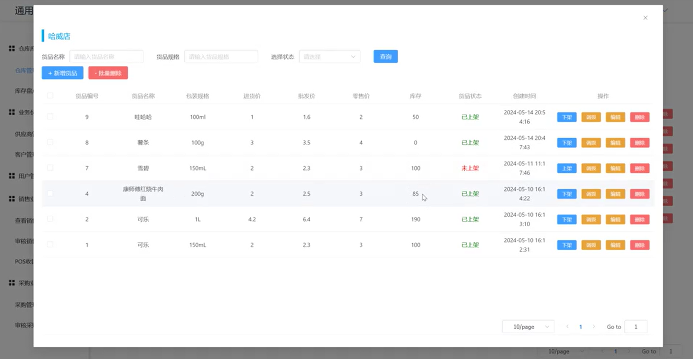

# ManageSystem

**This repository contains only the frontend part of the system.**

## Getting Started

Ensure that you have Node.js installed. Then, you can set up and run the project with the following commands:

```shell
npm install
npm run dev
```

## Resources

- You can find the full presentation video in `./demo/presentation.video`.

- Below is an overview of the system:

  

- The corresponding API documentation is available in `./api-all.md`.

I hope this program is helpful to you! 🚀
